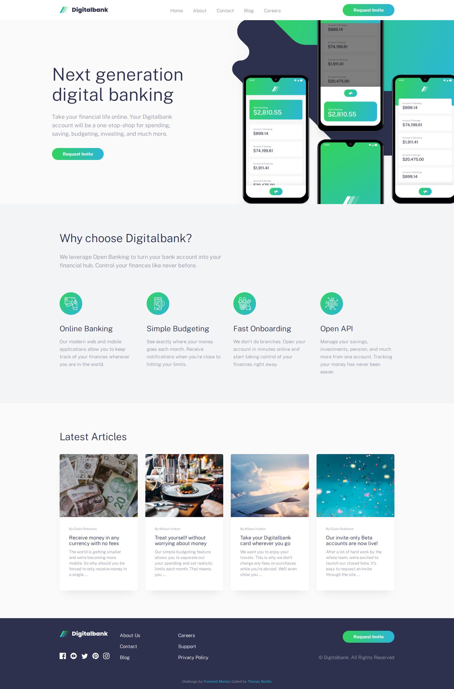
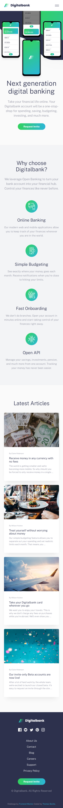

# Digitalbank — Landing page

> Landing page responsive d'une banque en ligne fictive, intégrée à partir des maquettes du challenge Frontend Mentor.




**🔗 [Demo en ligne](https://front-end-mentor-digital-bank-landi.vercel.app/)**

---

## 🎯 Objectif

Ce projet est une réalisation du challenge [Digital Bank Landing Page](https://www.frontendmentor.io/challenges/digital-bank-landing-page-WaUhkoDN) de Frontend Mentor. L'objectif était d'intégrer fidèlement les maquettes fournies (mobile 375px et desktop 1440px) avec une approche **mobile-first**, tout en mettant en place un véritable workflow d'outils front-end (Sass et TypeScript) plutôt que du CSS/JS bruts.

**Ce que j'ai appris :**

- Structurer des styles avec **Sass** : variables centralisées, partials (`_variables.scss`) et architecture **mobile-first** complétée par des `media-queries`.
- Reproduire des compositions délicates en CSS : positionnement du visuel décoratif (blob SVG + mockups) qui déborde et **s'adapte à la largeur du viewport** sans recouvrir le contenu.
- Écrire la logique d'interface en **TypeScript** (typé, mode `strict`) et la compiler : menu mobile accessible (`aria-expanded`, fermeture au clic, à la touche `Échap` et au passage en desktop).

---

## 🛠️ Stack

[](https://html5.org)
[](https://sass-lang.com)
[](https://www.typescriptlang.org)

---

## 🚀 Lancer le projet

Le site est statique : il suffit d'ouvrir `index.html` dans un navigateur. Pour retravailler les sources (Sass / TypeScript), installe les dépendances et lance la compilation.

```bash
# Cloner le dépôt
git clone https://github.com/Thomas-Bezille/FrontEnd-Mentor_Digital_bank_landing_page.git
cd FrontEnd-Mentor_Digital_bank_landing_page

# Installer les dépendances
npm install

# Compiler les styles et les scripts (CSS + JS)
npm run build
```

Ouvre ensuite `index.html` dans ton navigateur (ou via l'extension Live Server de VS Code).

### Scripts disponibles

| Commande                | Description                                      |
| ----------------------- | ------------------------------------------------ |
| `npm run build`         | Compile les styles **et** les scripts (CSS + JS) |
| `npm run build:css`     | Compile `scss/style.scss` → `css/style.css`      |
| `npm run build:css:min` | Version minifiée du CSS                          |
| `npm run build:ts`      | Compile `ts/main.ts` → `js/main.js`              |
| `npm run watch:css`     | Recompile le CSS à chaque sauvegarde             |
| `npm run watch:ts`      | Recompile le TypeScript à chaque sauvegarde      |

> 💡 En développement, lance `npm run watch:css` et `npm run watch:ts` dans deux terminaux.

---

## 👤 Contact

**Thomas Bezille** — Développeur web à Nantes

[](https://www.linkedin.com/in/thomas-bezille/)
[](https://github.com/Thomas-Bezille)
